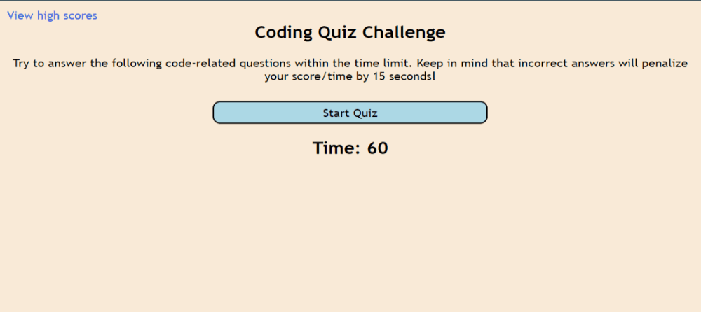

# Code Quiz

## Description

This is a quiz application using HTML, CSS, and Javascript. It has 4 questions for 25 points each, and it has time limited and loss your points if your answers is not correct.

You are able to view all of your high scores after you finis the first quiz.

## Installation

N/A

## Usage

## Credits

N/A

## License

---
